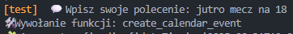
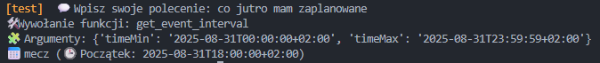
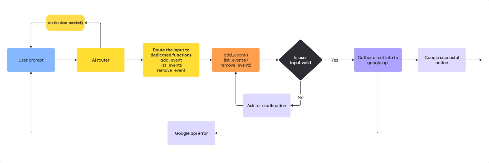

# Hermes AI Agent

[](https://www.python.org/)
[](https://developers.google.com/calendar)
[](https://ai.google.dev/)
[](https://developers.google.com/gmail/api)
[](https://oauth.net/2/)
[](.)

Lightweight Python assistant for managing **Google Calendar** (working) and **Gmail** (planned) via natural language using the Gemini API. Supports Polish commands to create, list, edit, and delete events; switch calendars; and customize colors and reminders.

---

Hermes AI Agent is a lightweight Python assistant for managing **Google Calendar** (working) and **Gmail** (under development) via prompts with Gemini API.  
It is designed to understands natural language commands in Polish and can create, delete, edit and list events, and in the future will also read and organize e‑mails.

##  **Features**

### 🗓️ Google Calendar
- Add events with name and date
- List events in given range 
- Create own reminders to events
- Choose colors to events
- Delete events by name (Hermes distinguish events with the same name)
- Edit events - edit all event properties
- switch between calendars
### 📧 Gmail (planned)
- filter emails by its properties
- creating and sending email
- move email to another folders
- basic operation with emails

## 🔧 Installation

### Requirements
- Python **3.10+**  
- Google Cloud account with enabled APIs:  
  - Google Calendar API  
  - Gmail API (for now optional - planned features)  
- Gemini API key

### Steps

1. **Clone repository**
   ```bash
   git clone https://github.com/TwojUser/HermesAI-Agent.git
   cd HermesAI-Agent
   ```

2. **Install dependencies**
   ```bash
   pip install -r requirements.txt
   ```

3. **Set environment variables**
   - Create a `.env` file and add:
     ```
     GEMINI_API_KEY=your_gemini_api_key_here
     ```
   - Place `credentials.json` (Google Cloud credentials) in the project root.

4. **Run the application**
   ```bash
   python main.py
   ```

## Usage examples




## Project structure

```
📁 HermesAI-Agent
 ┣ 📁 ai_tools_definitions # all objects and structures .json files for gemini function call 
 ┣ 📜 main.py        # Entry point
 ┣ 📜 ai_google_calendar.py       # all google calendar funtions
 ┣ 📜 utils.py         # helper global functions
 ┣ 📜 ai_router.py      # Gemini API prompt routing
 ┣ 📜 requirements.txt       # file with program requirements
 ┣ 📜 README.md 
 ┣ 📜.env      # your file with google api key
 ┣ 📜 credentials.json     # your file with calendar creds
 ┗ 📜 token.json        # auto generated file with google auth and refresh token
```

## Architecture
 The diagram below shows how Hermes AI Agent processes user input and interacts with Google APIs:



## 🛠️ Roadmap
- Google Calendar integration
- Gmail integration (in progress)
- react web interface
